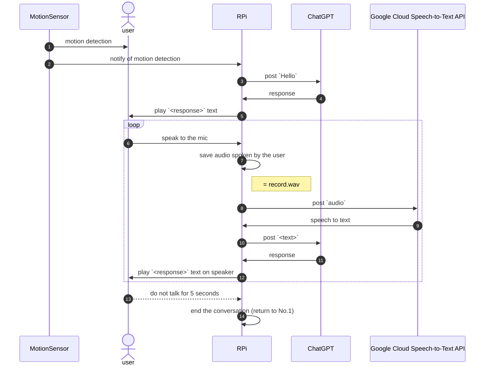

# raspi-talk

talk with raspberry pi

## System Overview



## Start Conversation

```console
$ python3 handler.py 2>/dev/null
```

`2>/dev/null` is added because the alsa related error log becomes noise.
I want to disable alsa error logs, but I don't know the way.

## License

[MIT License](https://github.com/kenzo0107/raspi-talk/blob/main/LICENSE)
